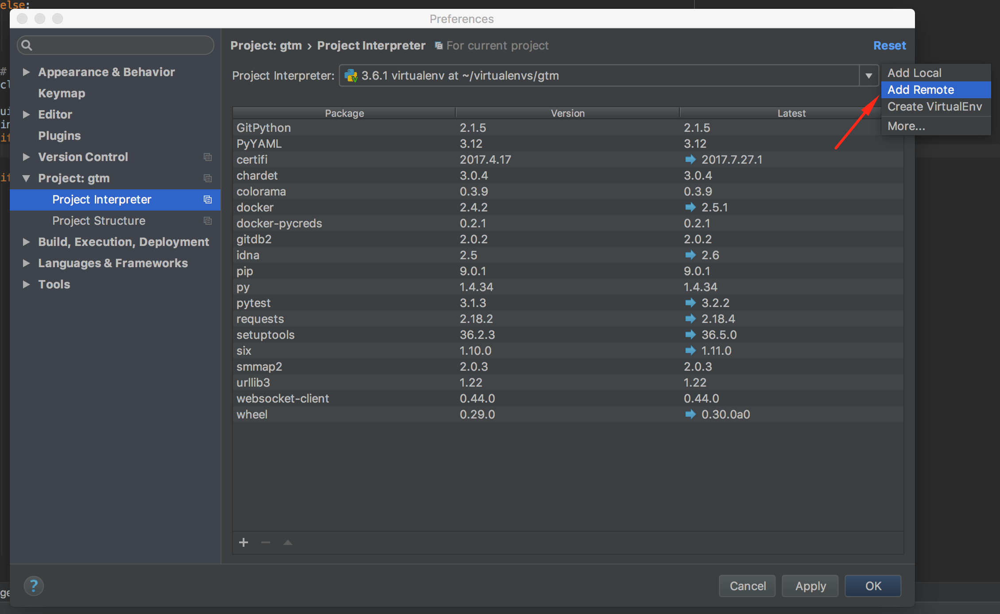
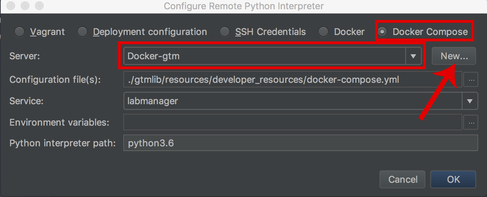
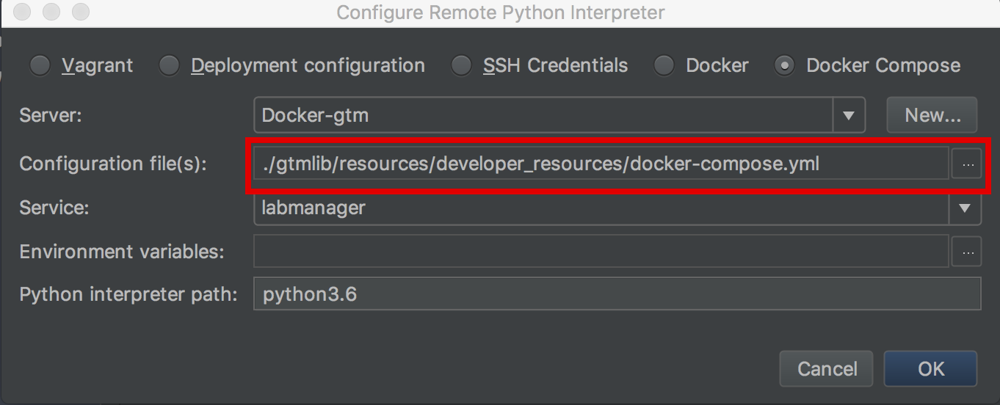
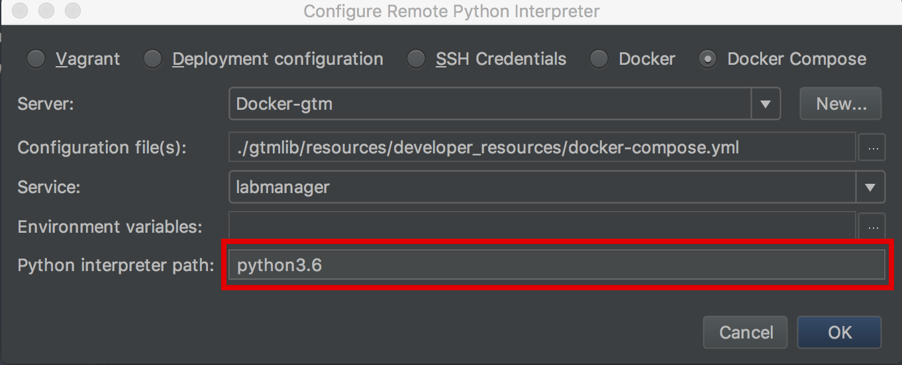

## PyCharm Development using Docker

### Overview

PyCharm is a useful IDE to use when developing the LabManager API and backend software. It natively interacts with docker
and can use a container as a remote interpreter. Note that after configuring PyCharm to use the container, it will use
the container for various operations including indexing and inspection. Be aware that you may notice a container running
sometimes when you haven't started any tests. This is typically due to indexing.

### Project Configuration

When developing in this configuration, it is recommended that you simply use the `gtm` repository as your single source
of truth. Clone `gtm` locally and setup the submodules as instructed. Create a PyCharm project with the `gtm` directory as
the project root.

You should then use PyCharm to directly edit the code in the submodule references to the other LabManager repos. The
submodules are located in `gtm/gtmlib/resources/submodules`. You can interact with the submodules like a normal
repository. Create new branches to work, commit, etc.

**BE SURE TO COMMIT CHANGES TO SUBMODULES BEFORE COMMITTING SUBMODULE REFERENCE CHANGES TO GTM**

### Build Dev Container

First run `gtm developer setup` in your terminal and select backend and PyCharm modes. Skip copying run configurations
at this point.

Next run `gtm developer -v build` to build your developer container. This can take a little while.

### Setup Pycharm

To use the dev container in PyCharm, you need to setup the remote interpreter. 

1. Open the Preferences window by clicking Pycharm > Preferences
2. Navigate to the interpreter screen by clicking Project > Project Interpreter in the left menu
3. Click Add Remote after clicking on the small gear as shown below

    
    
4. Select Docker Compose and a docker server. If you don't have a server available, click new and configure per PyCharm
instructions [here](https://www.jetbrains.com/help/pycharm/configuring-remote-interpreters-via-docker-compose.html).
In general, mac users should use "Docker for Mac" and Windows users should user "TCP socket" with the default port (2375).
    
    

5. Select the docker-compose.yml file that was generated after running `gtm developer setup` (if you haven't run that
yet, go do it). It is located in `gtm/gtmlib/resource/developer_resource/docker-compose.yml`.
    
    

6. Explicitly set the python interpreter to python3.6
    
    
    
7. In the Project file viewer, several directories need to be marked as a "Sources Root", by right-clicking, then 
   selecting *Mark Directory as > Sources Root*. These directories are both found under
   `gtm/gtmlib/resources/submodules`:
  - `labmanager-common`
  - `labmanager-service-labbook`
  
8. Also in `gtm/gtmlib/resources/submodules`, you can speed up development by marking `labmanager-ui` as "Excluded", otherwise PyCharm will force you to wait
   each time `node_modules` is rebuilt. (`node_modules` appears to be marked as excluded, but the indexing happens anyway
   unless manually excluded.)

### Using Run Configurations

Baseline run configurations come bundled with gtm. If you've set your project up like above, you can re-run `gtm developer setup`
and this time choose `yes` when asked about run configurations. This will copy into your PyCharm run configurations into your project
to run the dev API server and unit tests.