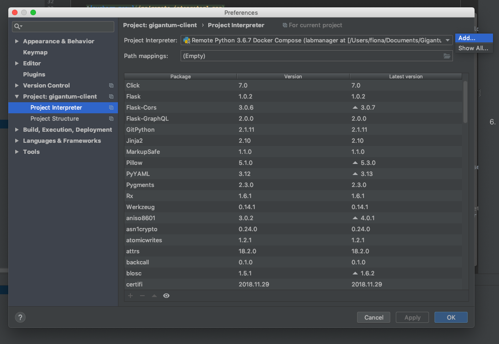
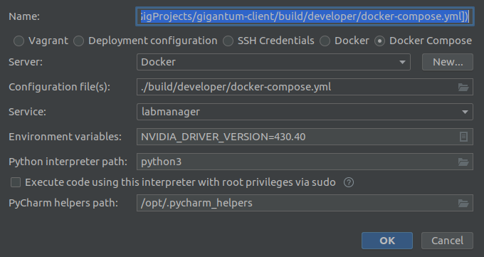

## PyCharm Development using Docker

### Overview

PyCharm is a useful IDE to use when developing the LabManager API and backend software. It natively interacts with docker
and can use a container as a remote interpreter. Note that after configuring PyCharm to use the container, it will use
the container for various operations including indexing and inspection. Be aware that you may notice a container running
sometimes when you haven't started any tests. This is typically due to indexing.

### Project Configuration

When developing in this configuration, it is recommended that you simply use the `gigantum-client` repository as your 
single source of truth. Clone `gigantum-client` locally. Create a PyCharm project with the `gigantum-client` directory as
the project root.

### Build Dev Container

First run `gtm dev setup` in your terminal and select backend and PyCharm modes. Skip copying run configurations
at this point.

Next run `gtm dev -v build` to build your developer container. This can take a little while.

### Setup Pycharm

To use the dev container in PyCharm, you need to setup the remote interpreter. 

1. Open the Preferences window by clicking Pycharm > Preferences
2. Navigate to the interpreter screen by clicking Project > Project Interpreter in the left menu
3. Click Add Remote after clicking on the small gear as shown below

    
    
4. Select Docker Compose and a docker server. If you don't have a server available, click new and configure with name 
`Docker-gtm`. In general, mac users should use "Docker for Mac" and Windows users should user "TCP socket" with the 
default port (2375).

5. Select the docker-compose.yml file that was generated after running `gtm dev setup` for the configuration file 
(if you haven't run that yet, go do it). It is located in `build/developer/docker-compose.yml`.

6. Explicitly set the python interpreter to python3

    

7. Apply changes and exit preferences
    
8. In the Project's file dropdown, several directories need to be marked as a "Sources Root", by right-clicking, then 
   selecting *Mark Directory as > Sources Root*:
   - `packages/gtmcore`
   - `packages/gtmapi`
 
9. Also in the Project's file dropdown, mark the `ui` directory as "Excluded" by right-clicking and selecting *Mark 
   Directory as > Excluded*

### Using Run Configurations

Baseline run configurations come bundled with gtm. If you've set your project up like above, you can re-run
`gtm dev setup` and this time choose `yes` when asked about run configurations. This will copy into your PyCharm run 
configurations into your project to run the dev API server and unit tests.
